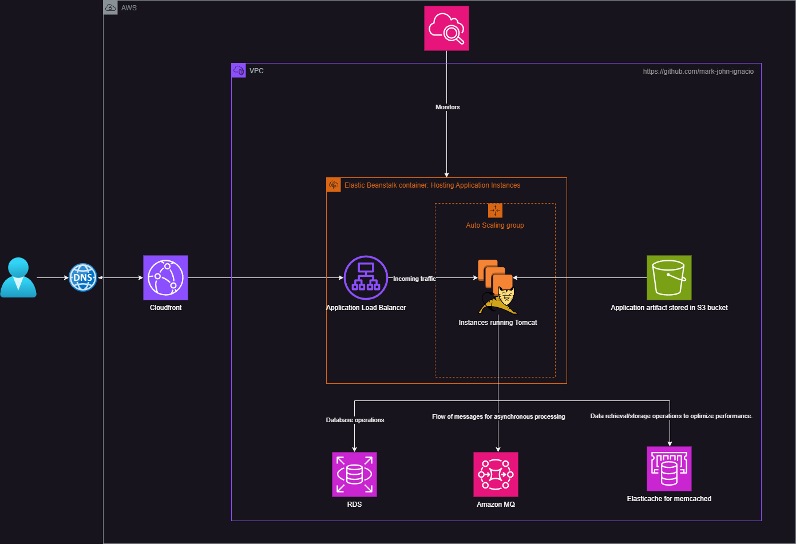

# VProfile PaaS Infrastructure Project

This Terraform project sets up the infrastructure for the VProfile application on AWS using PaaS (platform-as-a-service) products. It includes various components such as RDS, ElastiCache, Amazon MQ, Elastic Beanstalk, and CloudFront.

## Architecture Diagram



## Project Structure

- `data_sources.tf`: Defines data sources for VPC, subnets, AMIs, and other existing resources.
- `main.tf`: Contains the main infrastructure components including security groups, RDS, ElastiCache, Amazon MQ, IAM roles, and Elastic Beanstalk configuration.
- `output.tf`: Defines output variables and creates a local file with endpoint information.
- `provider.tf`: Specifies the required providers and backend configuration.
- `variables.tf`: Declares input variables for the project.

## Prerequisites

- AWS CLI configured with appropriate credentials
- Terraform installed (version compatible with AWS provider >= 4.9.0)
- An S3 bucket for Terraform state (specified in `provider.tf`)

## Key Components

1. **RDS MySQL Database**
2. **ElastiCache Memcached Cluster**
3. **Amazon MQ (RabbitMQ)**
4. **Elastic Beanstalk Environment**
5. **CloudFront Distribution**
6. **Various Security Groups and IAM Roles**

## Usage

1. Clone this repository.
2. Update the `variables.tf` file with your AWS access key and secret key (or use environment variables).
3. Initialize Terraform:
   ```
   terraform init
   ```
4. Review the planned changes:
   ```
   terraform plan
   ```
5. Apply the configuration:
   ```
   terraform apply
   ```

## Important Notes

- The project uses a default VPC and its subnets. Ensure these resources exist in your AWS account.
- An existing SSL certificate ARN is used for the Elastic Beanstalk environment and CloudFront distribution. Make sure this certificate exists in your AWS account or update the ARN.
- The project includes commented-out resources for executing SQL scripts. Uncomment and modify as needed.
- **SQL Executor and `aws_security_group_rule` `allow_eb_to_backend` are commented out** because they cause issues if they are run together with all the other resources.
- **Change credential path on provider** if using AWS credentials to run Terraform.
- **After Beanstalk is active:**
  - Clone [vprofile-project](https://github.com/hkhcoder/vprofile-project.git).
  - Navigate to `src/main/resources/application.properties` and change the credentials for:
    - **RDS**
    - **Memcached**
    - **RabbitMQ**
  - These credentials will be created by Terraform and saved in the `key` folder. You can also check the AWS console for the URL, host, and port.

### RabbitMQ Configuration:
- **Username:** `rabbit`
- **Password:** Found in the `key` folder.
- **Address:** Can be found in the Amazon MQ console, example:
  ```
  amqps://b-403fbcae-9d22-45fa-9a76-b103adf16703.mq.us-east-1.amazonaws.com:5671
  ```
- **Port:** `5671`

### JDBC Configuration:
- **Username:** `admin`
- **Password:** Found in the `key` folder.
- **JDBC URL:** Endpoint found in the RDS console, example:
  ```
  vprofile-rds-mysql.c9qgosauahei.us-east-1.rds.amazonaws.com
  ```
- **Port:** `3306`

### Memcached Configuration:
- **Host:** Found in the Amazon ElastiCache console under `Memcached caches`, example:
  ```
  vprofile-elasticache-svc.grob8j.cfg.use1.cache.amazonaws.com:11211
  ```

### Deployment:
1. Run `mvn -version` on your terminal to check Maven installation.
2. Run `mvn install`.
3. The WAR file will be located in the `target/` directory.
4. Go to the Elastic Beanstalk console, upload, and deploy the WAR file with your preferred version name.
5. Wait for it to be deployed.
6. Use the Beanstalk domain to create a CNAME record pointing to your domain.

### Terraform Backend:
- **Update 2024-08-19:** 
  - Used S3 for the backend of Terraform state in `provider.tf`.
  - If no S3 bucket exists, create one and update the `provider.tf` backend with the bucket name.
  - The key value specifies the name of the file on S3.

## Outputs

After applying the Terraform configuration, you can find the following information in the `key/endpoints.txt` file:

- RDS Endpoint and Port
- Memcached Endpoint and Port
- RabbitMQ Endpoint

## Security

- Ensure that the AWS credentials are kept secure and not committed to version control.
- Review and adjust security group rules as per your security requirements.

## Cleanup

To destroy the created resources:

```
terraform destroy
```

**Note:** This will delete all resources created by this Terraform configuration. Use with caution.

## Contributing

Feel free to submit issues or pull requests for any improvements or bug fixes.

## License
This project is licensed under the [MIT License](LICENSE). See the [LICENSE](LICENSE) file for more details.
